# 📁 Проектная работа «MyCloud»

- Задеплоенное приложение (Reg.ru): [http://95.163.220.194](http://95.163.220.194)

- Репозиторий с бэкендом: [https://github.com/maxter9595/MyCloud-Backend.git](https://github.com/maxter9595/MyCloud-Backend.git)

- Репозиторий с фронтендом: [https://github.com/maxter9595/MyCloud-Frontend.git](https://github.com/maxter9595/MyCloud-Frontend.git)

- Выполнил: [Терлецкий Максим Владимирович](https://cv-git-main-maxim-terltskiis-projects.vercel.app/)

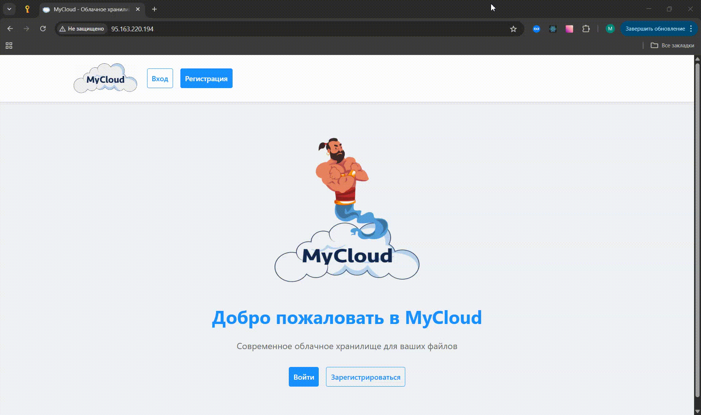

## 1. Инструкция по локальной настройке проекта

### 1.1. Реализовываем клонирование репозитория 

- Командная строка:

```commandline
git clone https://github.com/maxter9595/MyCloud-Backend.git MyCloud/backend && git clone https://github.com/maxter9595/MyCloud-Frontend.git MyCloud/frontend
```


### 1.2. Создаем БД в СУБД PostgreSQL. Настраиваем соединение к БД

- Командная строка:

```commandline
psql -h localhost -U postgres
CREATE DATABASE my_database;
\q
```

- Вход в DBeaver:

``` text
Хост: localhost
Порт: 5432
База данных: my_database
Пользователь: postgres (условно)
Пароль: postgres (условно)
```

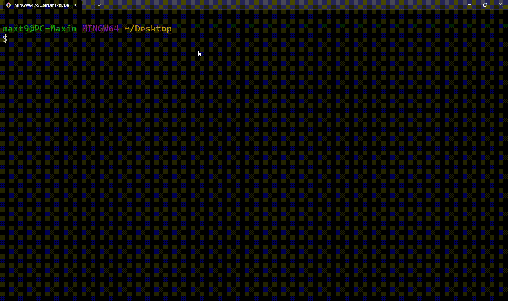


### 1.3. Настраиваем переменные окружения для бэкенда и фронтенда

- Переменные окружения бэкенда (можно скопировать из .env_example):

```
# ======================
# 1. Core Django Settings
# ======================
DEBUG=True
SECRET_KEY="om&g^x0jav04=du97ujqexuk6+h0o5l^q9t3j-sik!3c25q-!t"
ALLOWED_HOSTS="127.0.0.1,localhost"

# ======================
# 2. Database Configuration
# ======================
DB_NAME="my_database"
DB_USER="postgres"
DB_PASSWORD="postgres"
DB_HOST="localhost"
DB_PORT="5432"

# ======================
# 3. Security & CORS
# ======================
CORS_ALLOWED_ORIGINS="http://localhost:3000,http://127.0.0.1:3000"
```

- Переменные окружения фронтенда (можно скопировать из .env_example):

```
# ======================
# 1. API
# ======================
REACT_APP_API_BASE_URL=http://localhost:8000/api
```


### 1.4. Запуск бэкенда

- Командная строка:

```commandline
cd backend
python -m venv venv

venv\Scripts\activate ## Для Windows
source venv/bin/activate ## Для Linux/Mac

pip install -r requirements.txt

python manage.py makemigrations accounts
python manage.py makemigrations storage
python manage.py migrate

python manage.py createsuperuser
python manage.py runserver
```


### 1.5. Запуск фронтенда

- Командная строка:

```commandline
cd frontend
npm install
npm start
```


## 2. Инструкция по деплою веб-приложения: Backend

### 2.1. Заказываем облачные сервера в cloud.reg.ru

* Ссылка для заказа облачного сервера: [https://cloud.reg.ru/panel/](https://cloud.reg.ru/panel/)

* Параметры облачных серверов:

```
Образ: Ubuntu
Тарифный план: стандартный
Тариф: HP C2-M2-D40 (2 ядра vCPU, 2 ГБ RAM, 40 ГБ SSD)
Регион размещения: Москва
Плавающий (публичный) IP-адрес: да
Резервное копирование: да
```


* После покупки сервера на почту пришлют:

```
IP-адрес (пример - 95.163.221.31)
Логин (пример - root)
Пароль (пример - 5eHxbH8H5l8hD2kW, пароль не настоящий)
```

* В текущей ситуации будет два облачных сервера:

```
95.163.221.31 - Backend
95.163.220.194 - Frontend
```

### 2.2. Подключаемся к серверу по ssh через Git Bash

- Командная строка:

```commandline
ssh root@95.163.221.31
adduser my_user

usermod my_user -aG sudo
sudo chmod 750 /home/my_user
sudo usermod -a -G my_user www-data
```

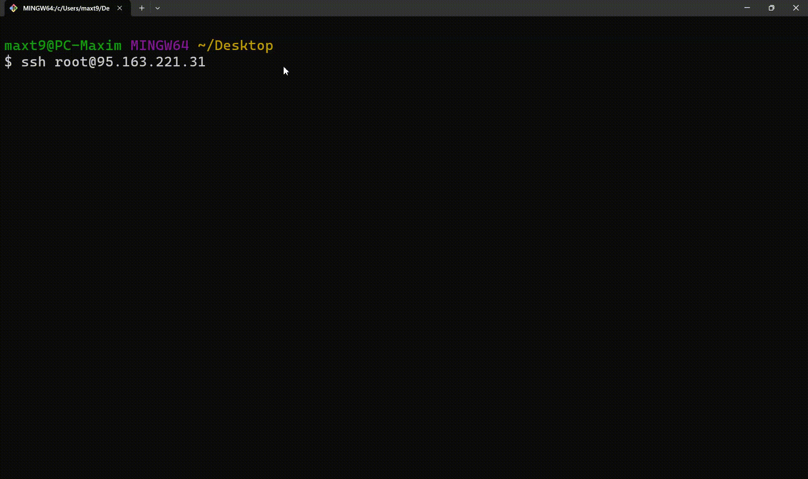

### 2.3. Настраиваем и активируем брандмауэр UFW (Uncomplicated Firewall)

- Командная строка:

```commandline
ufw allow OpenSSH
ufw enable
sudo ufw allow 8000
sudo ufw allow 80/tcp
sudo ufw allow 5432/tcp
sudo ufw allow 443/tcp
sudo ufw allow 5000/tcp
ufw status
```


### 2.4. Переключаемся на пользователя Linux и устанавливаем необходимые пакеты

- Командная строка:

```commandline
su my_user
sudo apt update

sudo chmod 750 /home/my_user
sudo usermod -a -G my_user www-data

sudo apt install -y curl wget git nginx python3-pip python3-venv postgresql postgresql-contrib libpq-dev nodejs npm certbot python3-certbot-nginx
```


### 2.5. Создаем БД в СУБД PostgreSQL

- Командная строка:

```commandline
sudo -u postgres psql

ALTER USER postgres WITH PASSWORD 'pass';
CREATE DATABASE my_user;
CREATE USER my_user WITH PASSWORD 'pass';

CREATE DATABASE my_db WITH OWNER my_user;
ALTER USER my_user WITH CREATEDB CREATEROLE;

GRANT ALL PRIVILEGES ON DATABASE my_db TO my_user;
GRANT ALL ON SCHEMA public TO my_user;

GRANT ALL PRIVILEGES ON ALL TABLES IN SCHEMA public TO my_user;
GRANT ALL PRIVILEGES ON ALL SEQUENCES IN SCHEMA public TO my_user;
ALTER DEFAULT PRIVILEGES FOR ROLE my_user IN SCHEMA public GRANT ALL ON TABLES TO my_user;

ALTER ROLE my_user SET client_encoding TO 'utf8';.
ALTER ROLE my_user SET default_transaction_isolation TO 'read committed';
ALTER ROLE my_user SET timezone TO 'Europe/Moscow';

\du my_user
\q
```


### 2.6. Настраиваем СУБД PostgreSQL для подключения через Dbeaver

- Командная строка:

```
psql --version
sudo nano /etc/postgresql/16/main/postgresql.conf

# Устанавливаем listen_addresses = '*' в разделе CONNECTIONS AND AUTHENTICATION
# Выходим из postgresql.conf

sudo nano /etc/postgresql/16/main/pg_hba.conf

# В конце файла pg_hba.conf добавляем следующее:
host    my_db      my_user      0.0.0.0/0       md5
# Выходим из pg_hba.conf

sudo chown -R postgres:postgres /var/lib/postgresql/16
sudo chmod 700 /var/lib/postgresql/16/main

sudo systemctl restart postgresql@16-main
sudo systemctl reload postgresql
```


- Подлючаемся к Dbeaver со следующими данными:

```
Хост: 95.163.221.31
База данных: my_db 
Пользователь: my_user 
Пароль: pass
```

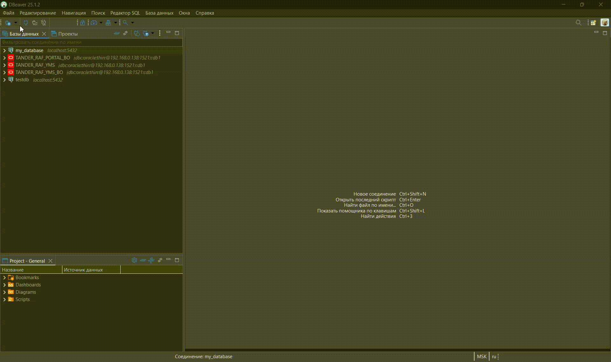

### 2.7. Скачиваем проект из GitHub и заходим в папку backend

- Выполняем следующее:

```
cd ~ # если не находимся на домашней директории пользователя
git clone https://github.com/maxter9595/MyCloud-Backend.git MyCloud/backend
cd MyCloud/backend

python3 -m venv env
source env/bin/activate
pip install -r requirements.txt
pip install gunicorn

sudo nano .env 
# Добавляем переменные окружения

# ======================
# 1. Core Django Settings
# ======================
DEBUG=True
SECRET_KEY="d#y5!z3&u%3s*#-#lu8+-$bz#*1wgs+%$7%7#0ip180web$51w" # при желании можно заменить в https://djecrety.ir
ALLOWED_HOSTS="95.163.221.31"

# ======================
# 2. Database Configuration
# ======================
DB_NAME="my_db"
DB_USER="my_user"
DB_PASSWORD="pass"
DB_HOST="localhost"
DB_PORT="5432"

# ======================
# 3. Security & CORS
# ======================
CORS_ALLOWED_ORIGINS="http://95.163.220.194,http://95.163.221.31"

# После добавления переменных окружения выходим из .env 
```


### 2.8. Настраиваем миграции. Собираем статику. Создаем суперпользователя

- Донастраиваем содержимое папки backend:

```
python manage.py makemigrations accounts
python manage.py makemigrations storage

python manage.py migrate
python manage.py createsuperuser

mkdir static
mkdir media
python manage.py collectstatic

sudo chown -R my_user:www-data /home/my_user/MyCloud/backend/static/
sudo chown -R my_user:www-data /home/my_user/MyCloud/backend/media/

sudo chmod -R 775 /home/my_user/MyCloud/backend/static/
sudo chmod -R 775 /home/my_user/MyCloud/backend/media/

python manage.py runserver 0.0.0.0:8000
```

- Заходим по ссылке на http://95.163.221.31:8000/admin и проверяем админку Django


### 2.9. Проверяем работу Gunicorn. Настраиваем и запускаем его

- Реализовываем следующее:

```
sudo lsof -i :8000 # Проверяем наличие процессов, занимающих порт 8000. Если пусто - продолжаем
gunicorn --bind 0.0.0.0:8000 mycloud.wsgi # Проверка работы Gunicorn

sudo nano /etc/systemd/system/gunicorn.socket
# Заполняем gunicorn.socket

[Unit]
Description=gunicorn socket

[Socket]
ListenStream=/run/gunicorn.sock

[Install]
WantedBy=sockets.target

# После заполнения выходим из gunicorn.socket

sudo nano /etc/systemd/system/gunicorn.service
# Заполняем gunicorn.service

[Unit]
Description=Gunicorn daemon
Requires=gunicorn.socket
After=network.target

[Service]
User=my_user
Group=www-data
WorkingDirectory=/home/my_user/MyCloud/backend
ExecStart=/home/my_user/MyCloud/backend/env/bin/gunicorn \
          --access-logfile - \
          --workers 3 \
          --bind unix:/run/gunicorn.sock \
          mycloud.wsgi:application
Environment="PYTHONPATH=/home/my_user/MyCloud/backend"

[Install]
WantedBy=multi-user.target

# После заполнения выходим из gunicorn.service

sudo systemctl start gunicorn.socket
sudo systemctl enable gunicorn.socket
sudo systemctl status gunicorn.service
```

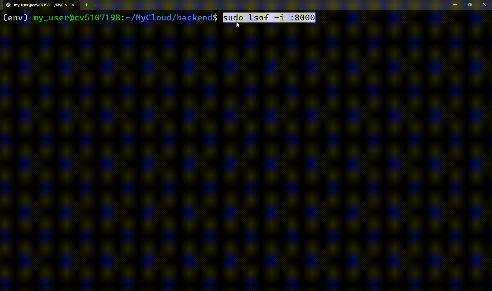


### 2.10. Настраиваем и запускаем Проверка работы Gunicorn, его настройка и запуск

- Выполняем следующее:

```
sudo nano /etc/nginx/nginx.conf 
# Меняем потенциальный размер файлов в nginx.conf

http {
    client_max_body_size 100M;  # добавляем переменную client_max_body_size в http
    # ...
}

# После добавления закрываем nginx.conf 

sudo nano /etc/nginx/sites-available/mycloud
# Заполняем серверные данные

server {
    listen 80;
    server_name 95.163.221.31;

    location = /favicon.ico { 
        access_log off; 
        log_not_found off; 
    }
    
    location /static/ {
        alias /home/my_user/MyCloud/backend/static/;
    }
    
    location /media/ {
        alias /home/my_user/MyCloud/backend/media/;
    }
    
    location / {
        include proxy_params;
        proxy_pass http://unix:/run/gunicorn.sock;
        proxy_set_header X-Forwarded-Proto $scheme;
    }
}

# После заполнения закрываем /etc/nginx/sites-available/mycloud

sudo ln -s /etc/nginx/sites-available/mycloud /etc/nginx/sites-enabled
sudo nginx -t
sudo systemctl restart nginx
sudo systemctl status nginx
```

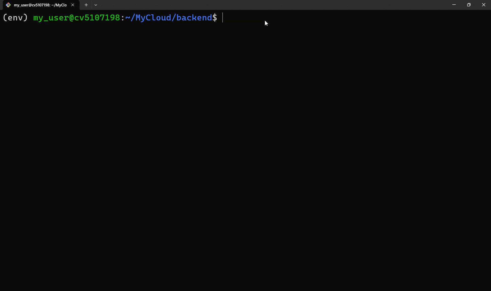

### 2.11. Проверяем запуск админки Django

- Проверяем http://95.163.221.31/admin. Открываем ссылку. Если все ок - продолжаем.

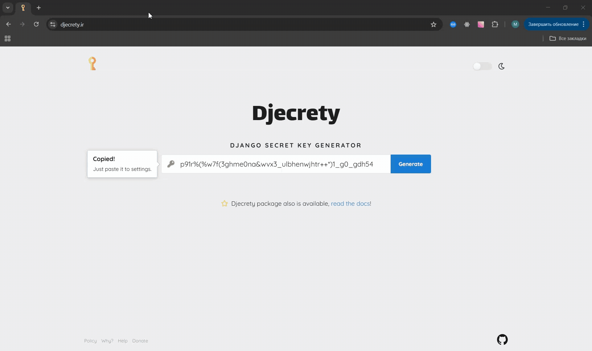

## 3. Инструкция по деплою веб-приложения: Frontend

### 3.1. Подключаемся к серверу по ssh через Git Bash

- Командная строка:

```commandline
ssh root@95.163.220.194
adduser my_user

usermod my_user -aG sudo
sudo chmod 750 /home/my_user
sudo usermod -a -G my_user www-data
```

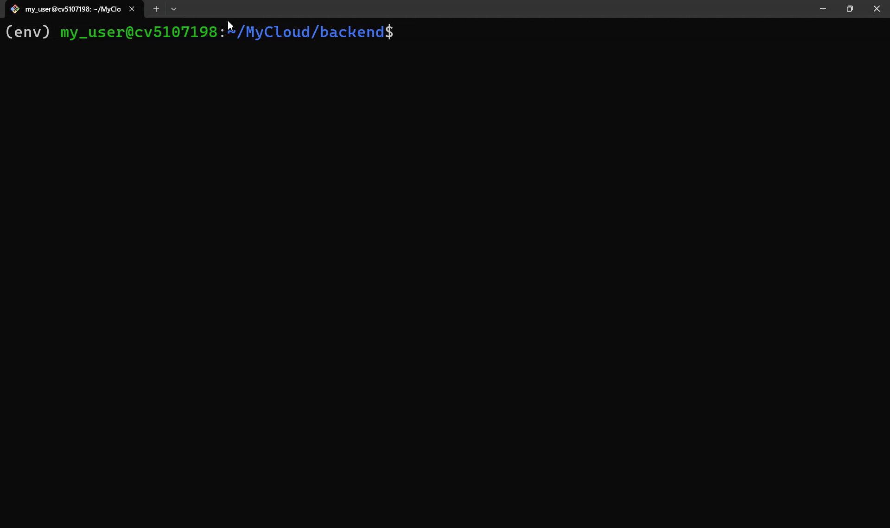

### 3.2. Настраиваем и активируем брандмауэр UFW (Uncomplicated Firewall)

- Командная строка:

```commandline
ufw allow OpenSSH
ufw enable
sudo ufw allow 8000
sudo ufw allow 80/tcp
sudo ufw allow 5432/tcp
sudo ufw allow 443/tcp
sudo ufw allow 5001/tcp
ufw status
```

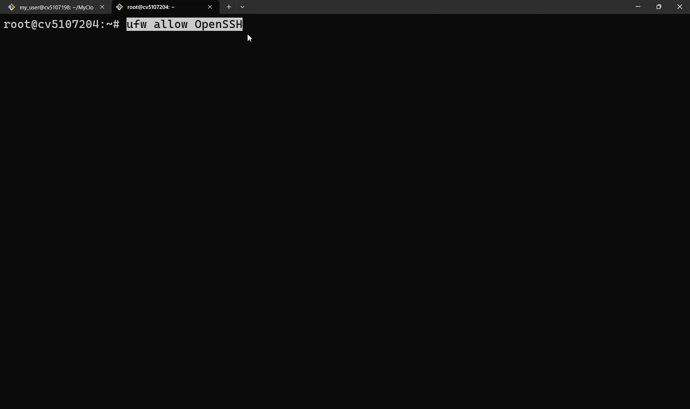

### 3.3. Переключаемся на пользователя Linux и устанавливаем необходимые пакеты

- Командная строка:

```commandline
su my_user
sudo apt update

sudo chmod 750 /home/my_user
sudo usermod -a -G my_user www-data

sudo apt install -y curl wget git nginx python3-pip python3-venv postgresql postgresql-contrib libpq-dev nodejs npm certbot python3-certbot-nginx
```


### 3.4. Скачиваем проект из GitHub и заходим в папку frontend. Настраиваем фронтенд

- Настраиваем фронтенд:

```
cd ~
git clone https://github.com/maxter9595/MyCloud-Frontend.git MyCloud/frontend
cd MyCloud/frontend

nano .env
# Устанавливаем переменную окружения REACT_APP_API_BASE_URL

REACT_APP_API_BASE_URL=http://95.163.221.31/api

# После установки REACT_APP_API_BASE_URL выходим из .env

nano package.json
# Меняем прокси из package.json на прокси бэкенда из другого сервера 

{
  "name": "mycloud-frontend",
  "version": "1.0.0",
  "private": true,
  ...
  "proxy": "http://95.163.221.31", # Устанавливаем прокси на бэкенд
  "devDependencies": {
    "react-dropzone": "^14.3.8",
    "react-icons": "^5.5.0"
  }
}

# После установки proxy выходим из package.json

npm install
npm run build
```


### 3.5. Настраиваем Nginx для фронтенда

- Проделываем следующее:

```
sudo nano /etc/nginx/sites-available/mycloud-frontend
# Заполняем серверные настройки

server {
    listen 80;
    server_name 95.163.220.194;

    root /home/my_user/MyCloud/frontend/build;
    index index.html;

    location / {
        try_files $uri $uri/ /index.html;
    }

    location /api {
        proxy_pass http://95.163.221.31;
        proxy_set_header Host $host;
        proxy_set_header X-Real-IP $remote_addr;
        proxy_set_header X-Forwarded-For $proxy_add_x_forwarded_for;
        proxy_set_header X-Forwarded-Proto $scheme;
    }
}

# После заполнения закрываем /etc/nginx/sites-available/mycloud-frontend

sudo ln -s /etc/nginx/sites-available/mycloud-frontend /etc/nginx/sites-enabled
sudo nginx -t
sudo systemctl restart nginx
```

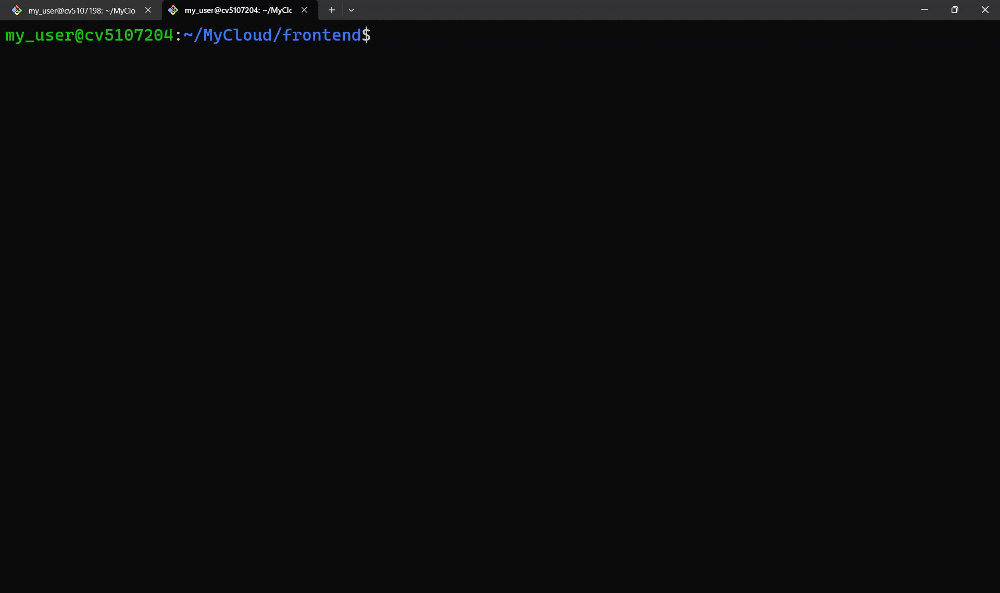

### 3.6. Проверяем наличие веб-приложения

- Открываем ссылку http://95.163.220.194/. Смотрим на результат.


## 4. Работа с веб-приложением после запуска

### 4.1. Регистрация и вход в приложение

- Выбираем раздел "Регистрация" и регистрируемся. После регистрации пользователя перебросит в хранилище файлов
- Для входа по логину и паролю используем раздел "Вход"
- Данные по пользователям и админам фиксируются в таблице accounts_customuser из БД


### 4.2. Работа с хранилищем

- Перетаскиваем файл в нужную область в стиле Drag and Drop или просто выбираем файл по кнопке "Выбрать файл"
- Далее пишем комментарий к файлу, если необходим, и нажимаем "Загрузить файл". Комментарий можно редактировать
- При желании можно скачать, передать по ссылке и удалить файл из хранилища пользователя
- Стандартный максимальный размер хранилища для админов и пользователей задается в settings.py (раздел "Storage Quotas"). При возникновении должной потребности админ может увеличить/уменьшить размер хранилища для конкретного пользователя


### 4.3. Работа с панелью администратора
- Админ вправе создать нового админа и изменить собственный пароль
- Администратор может деактивировать обычного пользователя, изменить его пароль и объем хранилища в ГБ, удалить его из БД
- Вместе с админ-панелью администраторы будут иметь собственное хранилище для хранения рабочих файлов (руководство администратора, шаблоны ответов на вопросы пользователей и т.п.). Принцип работы хранилища такой же как у обычных пользователей приложения


## 5. Настройка автодеплоя проекта: фронтенд

### 5.1. Создаем необходимые файлы. Запускаем webhook для фронтенда

- Выполняем следующее:

```
sudo apt install python3-flask -y
sudo apt install expect -y
sudo chmod u+x /usr/sbin/nginx

nano /home/my_user/update_frontend.sh
# Заполняем файл update_frontend.sh

-------- update_frontend.sh --------
#!/bin/bash
cd /home/my_user/MyCloud/frontend

git reset --hard HEAD
git clean -fd

git pull origin main

npm install
npm run build
-------- update_frontend.sh --------
```

```
chmod +x /home/my_user/update_frontend.sh
# После заполнения закрываем update_frontend.sh и настраиваем права

nano /home/my_user/update_frontend.exp
# Заполняем файл update_frontend.exp (user - пароль пользователя сервера)

-------- update_frontend.exp --------
#!/usr/bin/expect -f

set timeout 20

spawn /home/my_user/update_frontend.sh

expect "password" {
    send -- "user\r"
}

expect eof
-------- update_frontend.exp --------
```

```
chmod +x /home/my_user/update_frontend.exp
# После заполнения закрываем update_frontend.exp и настраиваем права

nano /home/my_user/webhook_frontend.py
# Заполняем файл webhook_frontend.py

-------- webhook_frontend.py --------
from flask import Flask, request
import subprocess

app = Flask(__name__)

@app.route('/webhook', methods=['POST'])
def webhook():
    if request.method == 'POST':
        subprocess.run(['/home/my_user/update_frontend.exp'])
        return 'OK', 200
    return 'Method not allowed', 405

if __name__ == '__main__':
    app.run(host='0.0.0.0', port=5001)
-------- webhook_frontend.py --------
```

```
sudo nano /etc/systemd/system/webhook_frontend.service
# После заполнения закрываем webhook_frontend.py и настраиваем systemd для webhook

-------- webhook_frontend.service --------
[Unit]
Description=Frontend Webhook Service
After=network.target

[Service]
User=my_user
WorkingDirectory=/home/my_user
ExecStart=/usr/bin/python3 /home/my_user/webhook_frontend.py
Restart=always

[Install]
WantedBy=multi-user.target
-------- webhook_frontend.service --------
```

```
# После заполнения закрываем webhook_frontend.service и запускаем webhook_frontend

sudo systemctl daemon-reload
sudo systemctl start webhook_frontend
sudo systemctl enable webhook_frontend

sudo systemctl status webhook_frontend
journalctl -u webhook_frontend -f --no-pager
```

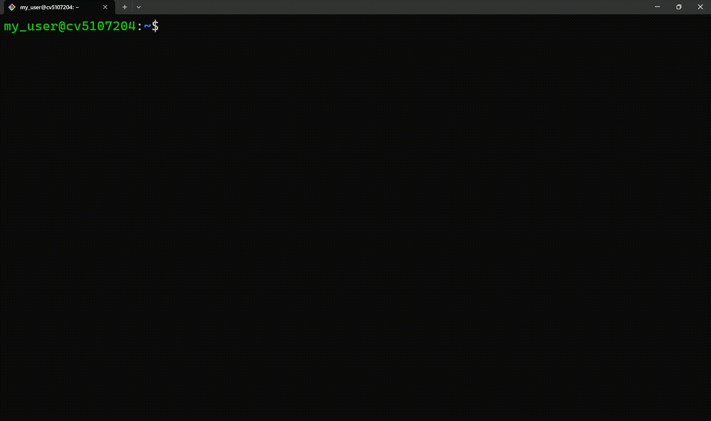

### 5.2. Привязываем webhook к репозиторию GitHub с фронтендом

- Заходим в репозиторий с фронтендом

- Settings > Webhooks. Нажимаем на кнопку "Add webhook" для привязки webhook к GitHub-репозиторию

- Заполняем данные по Webhook:
```
Payload URL: http://95.163.220.194:5001/webhook
Content type: application/json
Secret: не заполняем
SSL verification: Disable (not recommended)
Which events would you like to trigger this webhook?: Just the push event
Active: да
```

- После заполнения сохраняем webhook


### 5.3. Проверка автодеплоя фронтенда

- Делаем тестовый пуш в репозиторий с фронтендом

- Проверяем изменения на сайте http://95.163.220.194/ после пуша последних доработок

- Изменения появятся через некоторое время


## 6. Настройка автодеплоя проекта: бэкенд

### 6.1. Создаем необходимые файлы. Запускаем webhook для бэкенда

- Выполняем следующее:

```
sudo apt install python3-flask -y
sudo apt install expect -y
sudo chmod u+x /usr/sbin/nginx

nano /home/my_user/update_backend.sh
# Заполняем файл update_backend.sh

-------- update_backend.sh --------
#!/bin/bash
cd /home/my_user/MyCloud/backend

sudo systemctl stop gunicorn

git reset --hard HEAD
git clean -fd

git pull origin main

source /home/my_user/MyCloud/backend/env/bin/activate

pip install -r requirements.txt

python manage.py migrate

python manage.py collectstatic --noinput

sudo systemctl daemon-reload
sudo systemctl restart gunicorn
sudo systemctl restart nginx
-------- update_backend.sh --------
```

```
chmod +x /home/my_user/update_backend.sh
# После заполнения закрываем update_backend.sh и настраиваем права

nano /home/my_user/update_backend.exp
# Заполняем файл update_backend.exp (user - пароль пользователя сервера)

-------- update_backend.exp --------
#!/usr/bin/expect -f

set timeout 20

spawn /home/my_user/update_backend.sh

expect "password" {
    send -- "user\r"
}

expect eof
-------- update_backend.exp --------
```

```
chmod +x /home/my_user/update_backend.exp
# После заполнения закрываем update_backend.exp и настраиваем права

nano /home/my_user/webhook_backend.py
# Заполняем файл webhook_backend.py

-------- webhook_backend.py --------
from flask import Flask, request
import subprocess

app = Flask(__name__)

@app.route('/webhook', methods=['POST'])
def webhook():
    if request.method == 'POST':
        subprocess.run(['/home/my_user/update_backend.exp'])
        return 'OK', 200
    return 'Method not allowed', 405

if __name__ == '__main__':
    app.run(host='0.0.0.0', port=5000)
-------- webhook_backend.py --------
```

```
sudo nano /etc/systemd/system/webhook_backend.service
# После заполнения закрываем webhook_backend.py и настраиваем systemd для webhook

-------- webhook_backend.service --------
[Unit]
Description=Backend Webhook Service
After=network.target

[Service]
User=my_user
WorkingDirectory=/home/my_user
ExecStart=/usr/bin/python3 /home/my_user/webhook_backend.py
Restart=always

[Install]
WantedBy=multi-user.target
-------- webhook_backend.service --------
```

```
# После заполнения закрываем webhook_frontend.service и запускаем webhook_backend

sudo systemctl daemon-reload
sudo systemctl start webhook_backend
sudo systemctl enable webhook_backend

sudo systemctl status webhook_backend
journalctl -u webhook_backend -f --no-pager
```

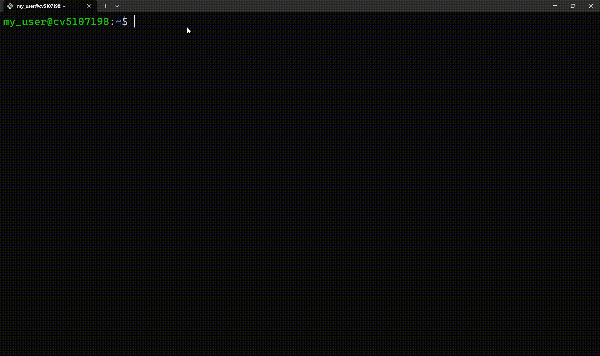

### 6.2. Привязываем webhook к репозиторию GitHub с бекэндом

- Заходим в репозиторий с бекэндом

- Settings > Webhooks. Нажимаем на кнопку "Add webhook" для привязки webhook к GitHub-репозиторию

- Заполняем данные по Webhook:
```
Payload URL: http://95.163.221.31:5000/webhook
Content type: application/json
Secret: не заполняем
SSL verification: Disable (not recommended)
Which events would you like to trigger this webhook?: Just the push event
Active: да
```

- После заполнения сохраняем webhook

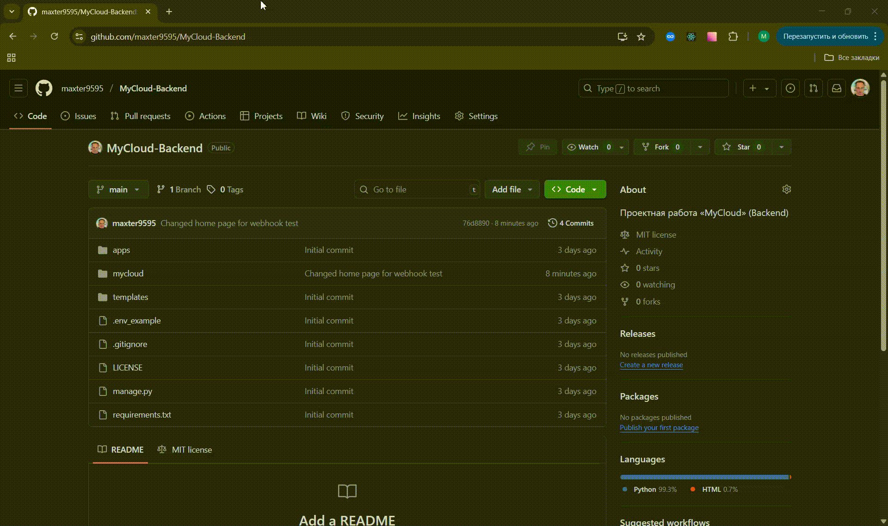

### 6.3. Проверка автодеплоя бэкенда

- Делаем тестовый пуш в репозиторий с бекэндом

- Проверяем изменения на сервере с IP-адресом 95.163.221.31 после пуша последних доработок

- Изменения появятся через некоторое время


